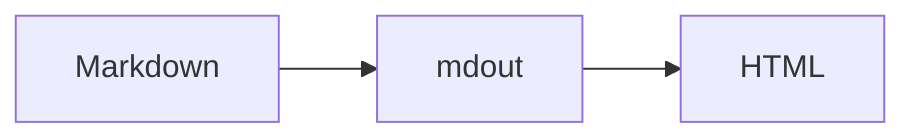

# mdout

Markdown in, HTML out. Built on Zola.

mdout 是一个基于 Zola 的写作、发布和阅读产品。Zola 负责把 Markdown 构建成静态站点，mdout 在它之上补齐内容检查、博客界面、搜索、公式与图表、双语内容、外链检查、测试和部署工作流。

它只服务三件事：

- 写文章方便。
- 发布过程可靠。
- 阅读体验舒适。

## mdout 和 Zola 的关系

Zola 是底层静态站点生成引擎，负责：

- Markdown 与 Frontmatter 解析。
- 页面、栏目和多语言路由。
- Tera 模板执行。
- Sass 编译和代码语法高亮。
- 标签 taxonomy、搜索索引、RSS、Sitemap 和本地开发服务器。

mdout 不重复实现这些能力，而是在 Zola 之上增加一套可以直接使用和 Fork 的博客产品层：

| 方面 | Zola 提供 | mdout 增加 |
| --- | --- | --- |
| 写作 | Markdown 解析 | 明确的文章格式、草稿约定和内容检查 |
| 构建 | `zola build` | 构建前检查、固定版本诊断和统一 CLI |
| 阅读 | 模板引擎 | 完整博客布局、正文排版、深色模式和响应式界面 |
| 搜索 | JSON 索引 | 搜索弹窗、标题/正文/标签检索、排序和键盘操作 |
| 公式 | Markdown 内容 | 本地 KaTeX 渲染、公式样式和 TeX 写法检查 |
| 图表 | 代码块 | 本地 Mermaid 渲染及深浅主题适配 |
| 代码 | 语法高亮 | 文件名标签、复制按钮和复制反馈 |
| 多语言 | 路由与译文关联 | 中文/英文界面、文章切换和语言独立搜索/RSS |
| 发布 | 静态输出 | CI、视觉 fixture、GitHub Pages 和自定义域名流程 |

因此，mdout 不是另一个静态站点生成器，也不只是一个 Zola 主题。它由 Zola 站点、Rust CLI、浏览器交互和发布工作流共同组成。

## 适合什么场景

mdout 适合希望直接管理 Markdown 文件，并把 Git 仓库作为内容来源的个人博客或笔记站点。

它有意不提供：

- CMS 和数据库。
- 在线富文本编辑器。
- 文章图片与封面系统。
- 复杂的发布状态机。
- 自动翻译或 AI 生成内容。

写作工作流保持为：

```text
编辑 Markdown
      ↓
mdout check
      ↓
本地预览或 Zola 构建
      ↓
推送 Git
      ↓
GitHub Pages 发布
```

## 环境要求

- Rust stable
- Zola 0.23.4

安装完成后，在仓库根目录运行：

```sh
cargo run -- doctor
```

如果 Zola 不在 `PATH` 中，通过 `MDOUT_ZOLA` 指定其位置：

```sh
MDOUT_ZOLA=/path/to/zola cargo run -- doctor
```

`doctor` 会检查 mdout 版本、Zola 版本、`zola.toml` 和 `content/`。

## 创建自己的博客

1. Fork 这个仓库。
2. 在 `zola.toml` 中修改 `base_url`、`title` 和 `author`。
3. 按需设置 `[extra]` 中的 `repository_url` 和 `copyright`。
4. 替换 `static/icon.png`。
5. 修改 `content/about.md` 和 `content/about.en.md`。
6. 在 `content/posts/` 中添加文章。

上游仓库不附带生产文章。用于检查排版的内容只存在于 `tests/fixtures/visual/`，不会进入正式站点。

## 写一篇文章

mdout 使用 YAML Frontmatter：

```markdown
---
title: 文章标题
description: 用于列表、搜索和订阅的简短摘要。
date: 2026-08-28
taxonomies:
  tags: [writing, rust]
---

从这里开始写正文。
```

文件保存为：

```text
content/posts/article.md
```

Frontmatter 规则：

- `title` 必填。
- `date` 必须使用 `YYYY-MM-DD`。
- `description` 建议填写。
- `tags` 必须是字符串列表。
- 草稿使用 `draft: true`。
- 不支持 `image`、`cover`、`socialImage` 或正文图片。

不需要执行 `new` 或 `publish`。Markdown 文件就是内容来源，删除文件就是删除文章，Git 历史负责版本管理。

## 草稿与预览

本地预览会包含草稿：

```sh
cargo run -- serve
```

默认地址为 `http://127.0.0.1:1111/`。

生产构建默认过滤 `draft: true` 的文章。需要临时构建草稿时使用：

```sh
cargo run -- build --drafts
```

## 中英文文章

中文是默认语言，位于 `/`；英文位于 `/en/`。

英文译文是可选的。在中文文件名的 `.md` 前加入 `.en`：

```text
content/posts/article.md
content/posts/article.en.md
```

两个文件具有相同的规范路径，Zola 会把它们识别为译文。页面上的 `中 / EN` 会优先打开同一篇文章的对应版本；没有译文时回到对应语言首页。

中文和英文分别拥有自己的：

- 文章列表与标签。
- 搜索索引。
- RSS：`/index.xml` 与 `/en/index.xml`。
- `llms.txt`：`/llms.txt` 与 `/en/llms.txt`。

mdout 不要求每篇文章都翻译，也不会自动翻译内容。

## LaTeX 公式

行内公式：

```markdown
$E = mc^2$
```

独立公式：

```markdown
$$
\int_{-\infty}^{\infty} e^{-x^2}\\,dx = \sqrt{\pi}
$$
```

Markdown 中的 TeX 标点和间距命令需要双反斜杠，例如 `\\,dx`。`mdout check` 会报告容易造成错误渲染的单反斜杠写法。公式由仓库内置的 KaTeX 在浏览器中渲染，不依赖 CDN。

## Mermaid 图表

使用普通 fenced code block：

````markdown

````

mdout 会检查图表类型，并在浏览器中按当前深浅主题渲染。Mermaid 同样从仓库本地加载。

## 代码块

代码语言交给 Zola 做语法高亮。可以使用 `name` 显示文件名：

````markdown
```rust,name=main.rs
fn main() {
    println!("hello");
}
```
````

mdout 会为代码块增加文件名标签和复制按钮。

## CLI

开发阶段可以直接通过 Cargo 运行：

```sh
cargo run -- doctor
cargo run -- check
cargo run -- serve
cargo run -- build
cargo run -- links
```

也可以安装到本机：

```sh
cargo install --path .
mdout doctor
```

命令说明：

- `doctor`：检查仓库结构和固定的 Zola 版本。
- `check`：检查 Frontmatter、日期、标签、图片、TeX 和 Mermaid。
- `serve`：包含草稿并启动本地预览。
- `build`：先检查内容，再构建到 `public/`。
- `links`：检查外部链接并更新 `reports/links.json`。

完整参数通过 `cargo run -- <command> --help` 查看。

## 搜索、标签和外链

Zola 为每种语言生成搜索 JSON，mdout 在浏览器中提供搜索弹窗、结果排序、正文摘要、标签匹配和键盘导航。

标签来自文章 Frontmatter。没有标签文章时，导航会自动隐藏标签入口，避免产生无效页面。

外链检查需要网络访问：

```sh
cargo run -- links
```

检查结果写入 `reports/links.json`，站点的外链状态页面读取这份静态报告。使用 `--strict` 可以让不可访问的链接导致命令失败。

## GitHub Pages

仓库包含两个工作流：

- `ci.yml`：运行格式检查、测试、内容检查、fixture 和构建。
- `pages.yml`：完成检查后上传 `public/` 并发布 GitHub Pages。

Pages 工作流会自动区分：

- 用户站点：`https://owner.github.io/`
- 项目站点：`https://owner.github.io/repository/`

因此 Fork 后不需要手动写死仓库子路径。

### 自定义域名

1. 创建 `static/CNAME`，内容为域名，例如 `www.example.com`。
2. 在仓库 Actions Variables 中创建 `SITE_URL`，值为完整地址，例如 `https://www.example.com/`。
3. 在 GitHub Pages 和 DNS 服务商处配置相同域名。

构建时 `SITE_URL` 会覆盖自动推导的 GitHub Pages 地址。

## 项目结构

```text
content/                 正式 Markdown 内容
reports/                 外链检查报告
sass/                    阅读界面样式
src/                     Rust CLI 与内容检查
static/js/               搜索、主题、公式、图表和复制交互
static/vendor/           本地 KaTeX 与 Mermaid
templates/               Zola 页面模板
tests/fixtures/visual/   不进入生产站点的阅读样例
scripts/                 本地和 CI 验证脚本
.github/workflows/       CI 与 GitHub Pages 发布
```

## 修改模板或样式

修改阅读界面后运行：

```sh
cargo test --locked
MDOUT_ZOLA=/path/to/zola scripts/verify-fixture.sh
```

fixture 会验证：

- 中文和英文文章路由。
- 有译文和无译文时的语言切换。
- 搜索索引、RSS 和 `llms.txt`。
- KaTeX、Mermaid 与代码增强资源。
- 404 页面和 GitHub Pages 子路径安全性。

## 维护 Fork

个人文章和站点配置保留在自己的 Fork 中。同步上游时重点检查 `templates/`、`sass/`、`static/`、`src/` 和工作流的变化，然后重新运行完整验证。

上游不会要求个人文章采用额外数据库结构，也不会改变“Markdown 文件就是内容”的基本模型。

## License

mdout 使用 MIT License。仓库内置浏览器依赖的版权和许可见 `THIRD_PARTY_NOTICES`。
