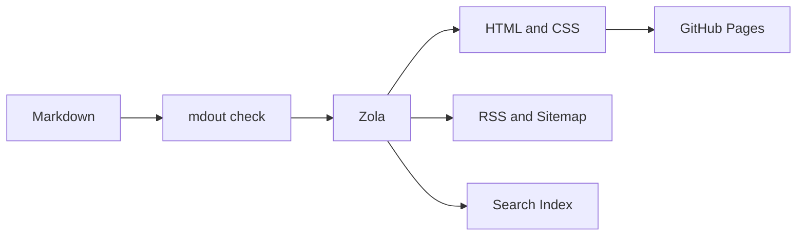

When `www.labspc.com` came back online, its home page was almost empty.

Search, RSS, dark mode, math, diagrams, and deployment were all ready. The only thing missing was an article. There was something ironic about that. To make writing easier, I had maintained three projects, spent a great deal of time studying Markdown pipelines, frontend components, static site generators, and deployment workflows, and only then returned to the most ordinary question: what did I actually want to write?

This article is a record of that process.

It is not a complete migration guide, and it is not a success story about rewriting TypeScript in Rust. Looking back, the path from [Zettelk](https://github.com/labspc/Zettelk) to [Zettelk-Lite](https://github.com/labspc/Zettelk-Lite) and finally to [mdout](https://github.com/labspc/mdout) was not primarily a change of technology. It was a change in how I evaluated a blog. I stopped asking how many features it had and started asking whether it made me more willing to write, whether publishing was dependable, and whether someone could read a long article without the interface demanding attention.

## I first wanted to build a digital garden

Zettelk began as a project based on [Quartz v4.5.1](https://github.com/jackyzha0/quartz). Quartz is a mature digital garden system. It understands Obsidian-flavored Markdown, Wiki Links, backlinks, tags, tables of contents, full-text search, math, and relationships between notes. It also provides a substantial build pipeline and component model.

Those capabilities are attractive. They turn a directory of Markdown files into something that feels less like a chronological publication and more like a knowledge network that can continue to grow and connect.

I extended Zettelk in the same direction. It used Bun, TypeScript, Preact, ESBuild, LightningCSS, and SCSS. At different points, its configuration enabled SPA navigation, hover previews, and analytics. I also explored richer tag management, image references, MCP, and LLM-related features. A few lines from the old configuration capture the mindset well:

```ts,name=quartz.config.ts
configuration: {
  pageTitle: "labspc",
  enableSPA: true,
  enablePopovers: true,
  analytics: {
    provider: "plausible",
  },
}
```

Each choice made sense in isolation.

SPA navigation could make transitions faster. Hover previews could reduce unnecessary jumps. A graph could reveal relationships between notes. An image system could organize visual material. Tag tools could improve classification. MCP and LLM interfaces seemed capable of making the knowledge base more intelligent. The project did not become complicated in one dramatic decision. Complexity accumulated through many small conclusions that each sounded like, "This might be useful too."

At one snapshot, `package.json` contained 66 direct runtime dependencies and 13 development dependencies, while the `quartz/` directory contained more than a hundred source files. Those numbers do not prove that the architecture was wrong. Quartz was designed to solve a genuinely complex problem, and dependency count is not a measure of reading quality. But the numbers did remind me that I was no longer maintaining only a place to publish articles.

More precisely, I had confused "I may need this one day" with "this belongs in the product now."

Quartz did nothing wrong. It serves a problem larger than my personal blog. The mismatch came from inheriting all the problems it solved before asking whether they were my problems.

## The blog was becoming a web application

The clearest cost of complexity was not installation time or the size of a dependency directory. It was the way my attention moved.

I found myself thinking about responsive sidebars, transition animations, graph layouts, search-dialog interactions, hydration boundaries, and the number of tools that should appear on mobile. These are real engineering problems, and they can be enjoyable problems. But as they occupied more development time, Markdown itself moved further into the background.

A blog can have application-level interactions, but it is not an application first. When a reader opens an article, the fundamental expectations remain modest: the page should appear quickly, the prose should be clear, links should work, code should be legible, and the layout should survive a small screen. If JavaScript never runs, the article should not disappear.

That realization led me to write a lightweight-refactoring document and reorder the priorities of the project:

```text
1. Simple
2. Static
3. Fast
4. Maintainable
5. Use Rust for appropriate computation
6. Feature richness comes last
```

One sentence in that document continued to shape mdout:

> This is a blog, not a Web App.

The sentence does not mean that every blog must be pure HTML, or that JavaScript is inherently bad. What changed was the default decision. The old default was, "If this can be built, why not add it?" The new question became, "If removing this does not harm writing, publishing, or reading, why keep it?"

The standard of quality changed with it.

I used to ask whether the page looked feature-rich. Now I would rather ask whether someone might willingly read it for ten uninterrupted minutes. I used to ask whether another system could be integrated. Now I ask whether I will still want to maintain the result a year later.

## Zettelk-Lite: proving that subtraction could work

Zettelk-Lite was the first bridge toward that new direction.

Its product definition was already close to the one mdout uses today:

```text
Markdown in.
Readable HTML out.
```

It served only three goals: make writing convenient, make publishing reliable, and make reading comfortable.

At this stage I did not immediately build a new static site generator in Rust. I introduced Zola instead. That was an important decision because Zola already solved many problems I had no reason to solve again: Markdown and Frontmatter parsing, sections, taxonomies, Tera templates, RSS, sitemaps, search indexes, Sass compilation, local preview, and multilingual routing.

Zettelk-Lite proved several things.

First, a complete reading experience did not require Preact. Template-generated HTML and carefully written CSS were enough for article lists, archives, tags, previous and next navigation, a table of contents, and responsive layouts.

Second, JavaScript could move from page infrastructure back to browser enhancement. Search, theme switching, code copying, KaTeX, and Mermaid still used small scripts, but the prose did not depend on them. If those scripts failed, the article remained on the page.

Third, subtraction did not require turning the blog into a page containing nothing but headings and paragraphs. Search deserved to remain because it helps me recover something I wrote months ago. Tags and archives remained because they provide simple ways to browse. Math and Mermaid remained because technical writing sometimes needs mathematical relationships and system structure. RSS, sitemaps, and external-link checks remained because they improve publishing quality and long-term readability.

I also made a personal decision: article images would no longer be supported. This was not a claim that images have no value. It was a conclusion about the writing I intended to do. My articles did not depend on images, while image support introduced another complete set of concerns: compression, dimensions, paths, migration, broken files, and cover design. For my writing, the maintenance cost was greater than the expressive benefit. The site still had an icon, and Mermaid could still produce diagrams, but article content returned to text, code, and structure.

Zettelk-Lite, however, was not yet as light as its name suggested. It still carried transitional Node and TypeScript tools, a legacy generator path, and many npm dependencies. At one snapshot it had 51 direct runtime dependencies and 11 development dependencies. The old and new paths existed together. It was more of a laboratory than a product I could freeze and use for years.

The greatest value of Zettelk-Lite was not that it had already become small. It showed me what could truly be removed and what still deserved to exist.

## Why I did not rewrite Zola in Rust

The original refactoring document considered a direct design: use Rust to scan files, parse Markdown, build tag and link indexes, and generate HTML, RSS, and search data.

```text
Markdown
   ↓
Rust parser
   ↓
HTML / RSS / Search Index
```

This design is entirely feasible. The Rust ecosystem has mature crates for Markdown parsing, templates, file traversal, serialization, and parallel processing. A custom implementation could eventually reduce the build command to one binary.

But the more I considered it, the less it matched another principle from the refactoring document: reducing code matters more than unifying the language.

Removing Zola would mean taking responsibility for Markdown dialects, Frontmatter, highlighting, templates, pagination, taxonomies, languages, feeds, sitemaps, incremental builds, and a development server. I would not have eliminated a mature dependency. I would have replaced it with a collection of decisions and edge cases that I owned forever. The implementation might have looked more uniform, but it would not have been simpler.

mdout therefore does not use Rust as a new static site engine. Its final division of responsibility looks like this:



Zola continues to generate the site. Rust handles the work that belongs to the mdout product layer: validating the content contract, diagnosing tool versions, checking external links, wrapping build commands, and generating a complete project scaffold.

Real simplification is not translating TypeScript into Rust line by line. It is refusing to reimplement a problem that a mature tool already solves.

## From Zettelk-Lite to mdout

The new name was not only an attempt to find a shorter repository name.

Zettelk was my digital garden, closely tied to a personal knowledge-management model. Zettelk-Lite was an experiment in subtraction and still lived in the shadow of the original project. mdout turned the parts that survived the experiment into a general product: Markdown goes in, readable HTML comes out.

Its boundary is expressed by six commands:

```text
mdout init
mdout doctor
mdout check
mdout serve
mdout build
mdout links
```

`check` validates Frontmatter, dates, tags, images, TeX, and Mermaid. `doctor` verifies the site layout and the pinned mdout and Zola versions. `serve` starts a local preview that includes drafts. `build` validates content and asks Zola to produce the site. `links` checks external references. `init` is what finally turns the repository into a scaffold product.

```sh
cargo install mdout --version 0.2.0 --locked

mdout init my-blog \
  --title "My blog" \
  --base-url "https://example.com/" \
  --author "Your name"

cd my-blog
mdout doctor
mdout serve
```

`mdout init` writes templates, styles, browser scripts, initial content, a version manifest, and GitHub Actions without needing the network. The generated repository has no `Cargo.toml` and no `src/`. A user installs the CLI once and then works inside an ordinary Markdown blog rather than inside mdout's Rust source tree.

That distinction also shaped the current branch model. `main` contains the mdout product source, and `v0.2.0` fixes the released product. The `blog` branch contains only labspc configuration, templates, and articles. Publishing the blog does not compile the product from source on every commit. The workflow installs a fixed mdout release, validates Markdown, and deploys Zola's `public/` directory to GitHub Pages.

This was one of the last boundaries I understood: a blog and the tool that generates it should be able to live independently. The tool can stop changing while the writing continues.

## What disappeared, and what remained

Seen across all three projects, the process was not simply a movement from large to small. Responsibilities gradually became clearer.

| No longer a default capability | Still present |
| --- | --- |
| SPA navigation | Markdown and Frontmatter |
| Hover previews | Search |
| Knowledge graphs | Tags and archives |
| CMS and databases | RSS and sitemaps |
| Image and cover systems | KaTeX and Mermaid |
| Complex publishing states | Drafts and Git history |
| A large frontend runtime | Small enhancement scripts |

Subtraction does not mean pursuing the fewest possible features. It means requiring each surviving feature to answer a question: does it directly improve writing, publishing, or reading?

Search, tags, archives, and RSS can answer yes. Dark mode does not change the prose, but it directly affects sustained reading. A copy button requires JavaScript, but it improves the use of technical articles. An external-link report is not the visual center of a blog, but it can reveal which references have broken after several years.

Graphs, hover previews, and SPA navigation are not bad features. They simply did not belong to my most common writing and reading paths. Removing them was not a victory of one technology over another. It was a choice about the product boundary.

## What remains worth writing in the Token age

While developing mdout, I found it increasingly difficult to avoid another question: when an LLM can quickly generate explanations, tutorials, and code, what is a personal blog for?

In the past, producing a working code sample could be enough to make an article useful. Today a prompt can produce versions in several languages, tests, comments, and usage instructions within seconds. Common API calls, ordinary CRUD, configuration templates, and introductory algorithm explanations are moving from scarce material to Tokens that can be generated whenever they are needed.

That does not make code sharing worthless. A more accurate conclusion is that code without context is losing value quickly.

A code sample becomes worth preserving when it carries something the generator cannot infer from syntax alone: why the problem appeared, what constraints existed, which alternatives failed, why an apparently advanced direction was removed, which assumptions proved wrong, and which conclusion the author is willing to defend.

Code can answer "how." An article should increasingly answer "why."

If I preserve only the final commands, the entire path from Quartz to mdout can be reduced to a few lines:

```sh
cargo install mdout --version 0.2.0 --locked
mdout init my-blog --title labspc --base-url https://www.labspc.com/
mdout serve
```

An LLM can explain those commands easily. The commands alone do not reveal why search remained while images disappeared, why Zola stayed instead of being replaced by a custom Rust renderer, why the CLI embeds a project scaffold, or why the product source and blog content live on separate branches. The relationships between those decisions are what deserve to be written down.

As Tokens become cheaper, human attention becomes more expensive. The internet will not suffer from a lack of content. It will lack selection, experience, judgment, and responsibility. A reader may not need another tutorial that covers every option. A complete account of one person making choices under real constraints can be more useful.

This changes how I understand plain textual records. A post does not need a grand conclusion or proof that the author has mastered the entire subject. It can faithfully preserve how a problem appeared, how an understanding changed, and how a solution became smaller. Dependency versions may be obsolete in a few years, while the process of judgment can remain readable.

## LLMs can participate, but they cannot decide what matters

LLMs participated in the analysis, development, testing, and documentation of these projects. They also participated in this article.

They are good at scanning repositories, comparing files, finding omissions, organizing commit history, suggesting tests, and challenging a plan that initially sounds reasonable. They reduce the cost of reading a large amount of code and arranging evidence. One person can complete work that would previously have required much more time.

LLMs are also very good at producing content that sounds complete. Paragraphs can be orderly, code can be polished, and conclusions can resemble experience even when they are detached from anything that actually happened. Without human selection, Tokens naturally fill every gap. The result can mention everything while taking responsibility for nothing.

I therefore want to preserve a clear boundary of responsibility.

An LLM can help me locate material, check facts, improve an explanation, and challenge a conclusion. It cannot decide why an article should exist, which experiences are real, which conclusions deserve to remain, or which technically correct paragraphs should still be deleted. If the final article is wrong, responsibility belongs to the person whose name is on it, not to the generation process.

In that sense, LLM-assisted writing does not remove the value of writing. It makes producing sentences cheaper and makes the author's selection more visible.

An LLM can reduce the cost of organizing words. It cannot decide what I should remember.

## The tool is finished; the writing is beginning

From Quartz to Zettelk, from Zettelk-Lite to mdout, I thought I was searching for the right technology stack. Looking back, I was changing the standard by which I judged the result: from feature count to content quality, from building a system to leaving behind words worth reading again.

Quartz taught me how a mature Markdown pipeline and plugin system can be organized. Extending Zettelk showed me how naturally features accumulate. Zettelk-Lite proved that static pages and a small amount of JavaScript were enough. Zola taught me to respect the boundary of a mature tool. mdout finally compressed those lessons into a few commands and a version that can stop changing.

mdout has been released, and the blog has been deployed. There will still be style problems, broken links, and new writing needs. But the most important next step is no longer another generator feature. It is to use the generator.

This is the first article.

```text
Markdown in.
Readable HTML out.
Judgment in between.
```
