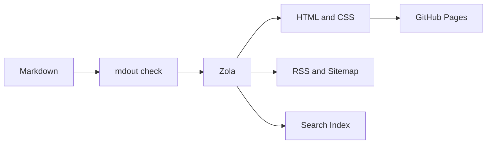

`www.labspc.com` 重新上线时，首页几乎是空的。

搜索、RSS、深色模式、公式、图表和部署流程都已经准备好了，真正缺少的只有文章。这多少有些讽刺：为了方便写作，我先后维护了三个项目，花了很多时间研究 Markdown 管线、前端组件、静态站点生成器和发布工作流，最后才回到一个最普通的问题：我到底想写什么？

这篇文章就是对这段过程的记录。

它不是一份完整的迁移手册，也不是用 Rust 重写 TypeScript 的成功故事。回头看，从 [Zettelk](https://github.com/labspc/Zettelk) 到 [Zettelk-Lite](https://github.com/labspc/Zettelk-Lite)，再到 [mdout](https://github.com/labspc/mdout)，真正发生的并不是技术栈的替换，而是评价标准的变化：我不再用功能数量判断一个博客是否完善，而是开始关心它能不能让我更愿意写、能不能稳定发布、能不能让一篇长文被安静地读完。

## 最初，我想建造一座数字花园

Zettelk 最初基于 [Quartz v4.5.1](https://github.com/jackyzha0/quartz)。Quartz 是一个非常成熟的数字花园工具：它理解 Obsidian 风格的 Markdown，能够处理 Wiki Link、反向链接、标签、目录、全文搜索、数学公式和内容关系，也提供完整的构建与页面组件体系。

这些能力很有吸引力。它们让 Markdown 文件不再只是按日期排列的文章，而像是一个能够不断连接和生长的知识网络。

在 Zettelk 中，我继续沿着这个方向扩展。项目使用 Bun、TypeScript、Preact、ESBuild、LightningCSS 和 SCSS；配置中打开过 SPA 路由、悬浮预览和分析统计，也加入了更复杂的标签管理、图片引用、MCP 与 LLM 相关尝试。旧配置中的几行代码很能说明当时的思路：

```ts,name=quartz.config.ts
configuration: {
  pageTitle: "labspc",
  enableSPA: true,
  enablePopovers: true,
  analytics: {
    provider: "plausible",
  },
}
```

单独看，每个功能都有理由。

SPA 可以让页面切换更快，悬浮预览可以减少跳转，图谱可以显示内容关系，图片系统可以管理视觉材料，标签工具可以帮助整理文章，MCP 和 LLM 接口似乎又能让整个知识库更智能。功能不是在某一天突然变复杂的，而是在一次次“这个也挺有用”的判断中慢慢累积起来的。

当时的 `package.json` 有 66 个直接运行依赖和 13 个开发依赖，`quartz/` 下有一百多个源文件。这些数字本身并不能证明架构有问题：Quartz 原本就在解决一个复杂问题，而且依赖数量也不能直接等同于页面质量。但它们提醒了我，我正在维护的已经不再只是一个放文章的地方。

更准确地说，我把“未来也许会需要”误当成了“现在应该拥有”。

Quartz 没有做错。它服务的是比我的个人博客更复杂的问题。真正的问题是，我继承了它解决的问题，却没有先确认那些问题是不是我的问题。

## 博客逐渐变成了一个 Web App

复杂度最明显的表现，不只是安装时间或者依赖目录大小，而是注意力被转移了。

我会思考侧边栏应该怎样响应，页面切换要不要动画，图谱如何布局，搜索弹窗应该有多少交互，某个组件是否需要 hydration，移动端工具栏要显示哪些入口。这些问题都是真实的工程问题，也都可以做得很有趣。但当它们不断占据开发时间时，Markdown 本身反而退到了后面。

一个博客可以有应用级的交互，但它首先不是应用。读者打开一篇文章，最基本的期待仍然是：页面快速出现，正文清楚，链接可用，代码能读，手机上不会错位。即使 JavaScript 没有执行，文章也不应该消失。

这促使我写下了一份轻量化重构文档，并重新排列项目的优先级：

```text
1. 简单
2. 静态
3. 快速
4. 可维护
5. Rust 优先处理计算任务
6. 最后才考虑功能丰富度
```

文档里还有一句后来一直影响 mdout 的话：

> 这是一个博客，不是 Web App。

这句话不是要求所有博客都只能有纯 HTML，也不是说 JavaScript 天然不好。它真正改变的是默认选择：过去是“如果能做，为什么不加”；后来变成“如果删除它不影响写作、发布和阅读，为什么要保留”。

评价标准也随之改变。

以前我会问：页面看起来是否功能很多？现在我更愿意问：用户是否愿意连续阅读十分钟？以前我会问：能不能再接入一个系统？现在我会问：一年后我是否还愿意维护它？

## Zettelk-Lite：先证明减法可以成立

Zettelk-Lite 是这次转向的第一座桥。

它的产品定义已经非常接近今天的 mdout：

```text
Markdown in.
Readable HTML out.
```

它只服务三件事：方便写作、可靠发布、舒适阅读。

在这个阶段，我没有立刻从头写一个新的 Rust 静态站点生成器，而是引入了 Zola。这个决定很重要，因为 Zola 已经可靠地解决了很多并不值得我重新解决的问题：Markdown 和 Frontmatter 解析、Section、Taxonomy、Tera 模板、RSS、Sitemap、搜索索引、Sass 编译、本地预览和多语言路由。

Zettelk-Lite 证明了几件事。

第一，页面不需要 Preact 才能拥有完整的阅读体验。模板生成的 HTML 加上手写样式，已经足以实现文章列表、归档、标签、上一篇与下一篇、目录和响应式布局。

第二，JavaScript 可以从页面基础设施退回到“浏览器增强”。搜索弹窗、主题切换、代码复制、KaTeX 和 Mermaid 仍然需要少量脚本，但正文阅读不依赖它们。脚本加载失败时，文章依然存在。

第三，删除功能并不等于把博客做成一个只有标题和段落的页面。搜索值得保留，因为它帮助我重新找到过去写过的内容；标签和归档值得保留，因为它们提供朴素的浏览方式；公式和 Mermaid 值得保留，因为技术写作确实需要表达数学关系和系统结构；RSS、Sitemap 和外链检查值得保留，因为它们改善发布质量和长期可读性。

同时，我也做了一个很个人的决定：不再支持文章图片。并不是图片没有价值，而是我接下来想写的内容不依赖图片。图片会带来压缩、尺寸、路径、迁移、失效和封面设计等另一整套问题。对于我的写作方式，它的维护成本高于表达收益。站点图标仍然存在，Mermaid 也可以生成图形，但文章内容回到了文本、代码和结构本身。

不过，Zettelk-Lite 并不是真的已经足够 Lite。它仍然保留着迁移期的 Node 与 TypeScript 工具、旧生成器入口和不少 npm 依赖。当时快照里仍有 51 个直接运行依赖和 11 个开发依赖。新旧路径同时存在，意味着它更像一个实验场，而不是可以长期固定下来的产品。

Zettelk-Lite 最大的价值，不是它已经足够轻，而是它让我知道哪些东西确实可以删除，哪些能力仍然值得留下。

## 为什么没有用 Rust 重写 Zola

轻量化文档最初设想过一条很直接的路线：用 Rust 扫描文件、解析 Markdown、建立标签与链接索引，再生成 HTML、RSS 和搜索数据。

```text
Markdown
   ↓
Rust parser
   ↓
HTML / RSS / Search Index
```

这条路线在技术上完全可行。Rust 生态里有成熟的 Markdown parser、模板引擎、文件遍历、序列化和并行处理 crate。自己实现以后，构建流程也可以只剩一个二进制。

但进一步思考后，我发现这并不符合“代码量下降比语言统一更重要”的原则。

如果为了删除 Zola，我需要重新处理 Markdown 方言、Frontmatter、代码高亮、模板、分页、Taxonomy、多语言、Feed、Sitemap、增量构建和开发服务器，那么项目只是把一套成熟依赖换成了一套由自己负责的实现。它也许更统一，却未必更简单。

因此，mdout 没有把 Rust 当成新的静态站点引擎。最终的职责划分是：



Zola 继续负责静态站点生成；Rust 负责真正属于 mdout 产品层的工作：内容契约检查、版本诊断、外链检查、构建命令封装和站点脚手架。

真正的轻量化，不是把 TypeScript 逐行翻译成 Rust，而是拒绝重写已经被成熟工具解决的问题。

## 从 Zettelk-Lite 到 mdout

改名并不只是为了找一个更短的仓库名称。

Zettelk 是我的数字花园，名称和个人知识管理方式联系得很紧。Zettelk-Lite 是一次减法实验，它仍然处在旧项目的影子里。mdout 则试图把已经验证的部分整理成一个通用产品：输入 Markdown，输出适合阅读的 HTML。

它的边界被压缩成六个命令：

```text
mdout init
mdout doctor
mdout check
mdout serve
mdout build
mdout links
```

`check` 检查 Frontmatter、日期、标签、图片、TeX 和 Mermaid；`doctor` 检查站点结构以及固定的 mdout 与 Zola 版本；`serve` 包含草稿并启动本地预览；`build` 在内容检查后调用 Zola 生成生产站点；`links` 检查外链；`init` 则把整个产品真正变成了脚手架。

```sh
cargo install mdout --version 0.2.0 --locked

mdout init my-blog \
  --title "My blog" \
  --base-url "https://example.com/" \
  --author "Your name"

cd my-blog
mdout doctor
mdout serve
```

`mdout init` 会离线写出模板、样式、浏览器脚本、初始内容、版本清单和 GitHub Actions。生成结果里没有 `Cargo.toml`，也没有 `src/`。使用者安装一次 CLI，之后面对的是一个普通的 Markdown 博客仓库，而不是 mdout 自身的 Rust 工程。

这也形成了现在的分支结构：`main` 保存 mdout 的产品源码，`v0.2.0` 固定正式版本，`blog` 只保存 labspc 的配置、模板和文章。部署博客不需要在每次提交时编译项目源码，工作流只安装固定版本的 mdout，检查 Markdown，然后把 Zola 生成的 `public/` 发布到 GitHub Pages。

这是我最后才想明白的一点：博客与生成博客的工具应该彼此独立。工具可以停止变化，文章仍然可以继续增加。

## 删除了什么，也留下了什么

从三个项目回头看，这条路径并不是简单地从“大”变成“小”。真正发生的是职责逐渐清楚。

| 不再作为默认能力 | 仍然保留 |
| --- | --- |
| SPA 路由 | Markdown 与 Frontmatter |
| 悬浮预览 | 搜索 |
| 关系图谱 | 标签与归档 |
| CMS 与数据库 | RSS 与 Sitemap |
| 图片与封面系统 | KaTeX 与 Mermaid |
| 复杂发布状态机 | 草稿与 Git 历史 |
| 大型前端运行时 | 少量浏览器增强脚本 |

减法并不是追求功能最少，而是要求每个留下来的功能回答一个问题：它是否直接改善写作、发布或者阅读？

搜索、标签、归档和 RSS 的答案是肯定的。深色模式不会改变文章内容，但它直接影响长时间阅读。代码复制按钮需要 JavaScript，却能改善技术文章的使用体验。外链状态页不是博客的视觉核心，但它能提醒我多年以后哪些引用已经失效。

相反，图谱、悬浮预览和 SPA 并不是坏功能，只是它们没有进入我最常见的写作与阅读路径。删除它们不是技术判断上的胜负，而是产品边界上的选择。

## Token 时代，写什么仍然重要

开发 mdout 的同时，我也越来越难回避另一个问题：在 LLM 可以快速生成解释、教程和代码的今天，个人博客还有什么价值？

过去，能够写出一段可运行的代码，本身就可能构成一篇有用的文章。现在，把需求交给 LLM，几秒钟内就能得到多个语言版本、测试、注释和使用说明。常见 API 的调用方式、普通 CRUD、配置文件模板和基础算法解释，正在从稀缺内容变成随时可以生成的 Token。

这并不意味着代码分享已经没有价值。更准确的说法是：没有上下文的代码片段正在快速贬值。

一段代码真正值得被记录，往往不是因为它包含了某种语法，而是因为它背后还有生成器不知道的部分：为什么会遇到这个问题，当时受到什么约束，试过哪些方案，为什么某个看似先进的方向最后被删除，哪些判断后来证明是错的，以及作者愿意为哪个结论负责。

代码可以回答“怎么做”，文章更应该回答“为什么这样做”。

例如，从 Quartz 到 mdout，如果只保留最终命令，那么这段经历可以被压缩成几行：

```sh
cargo install mdout --version 0.2.0 --locked
mdout init my-blog --title labspc --base-url https://www.labspc.com/
mdout serve
```

LLM 很容易解释这些命令，却无法仅凭命令知道我为什么保留搜索、删除图片，为什么采用 Zola 而不是自己写 Rust renderer，为什么让 Rust CLI 内嵌脚手架，又为什么把产品源码和博客内容放在不同分支。真正值得写下来的，是这些决定之间的关系。

Token 变得便宜以后，人的注意力反而更贵。互联网上不会缺少内容，缺少的是选择、经验、判断和责任。读者需要的也未必是另一篇覆盖所有选项的教程，而可能只是一个人在真实约束下做出选择的完整过程。

这让我重新理解“纯粹的文字记录”。它不一定要给出宏大的结论，也不需要证明作者掌握了所有相关知识。它可以只是忠实地保存一次问题如何出现、认识如何改变、方案如何收缩。几年后，具体依赖版本可能已经过时，但这种判断过程仍然可以被重新阅读。

## LLM 可以参与，但不能替我决定什么值得留下

这几个项目的分析、开发、测试和文档过程中都有 LLM 参与，这篇文章也一样。

LLM 很适合扫描仓库、比较文件、发现遗漏、整理提交历史、生成测试思路，也可以对一个看似合理的方案提出反例。它降低了阅读大量代码和组织材料的成本，让一个人可以完成过去需要更多时间才能完成的工作。

但它也很擅长生成“听起来完整”的内容。段落可以结构清楚，代码可以格式漂亮，结论可以像经验总结，却不一定和真实经历有关。如果没有人的选择，Token 会自然地填满所有空白，最后得到一篇什么都提到、却没有真正立场的文章。

所以我希望保留一条责任边界。

LLM 可以帮助我找材料、检查事实、修改表达和挑战判断；但文章为什么要写、哪些经历是真实的、哪些结论值得保留、哪些段落虽然正确却应该删除，仍然由我决定。最终出现错误，也应该由署名的人负责，而不是把责任推给生成过程。

在这个意义上，LLM 辅助写作并不会让写作失去价值。相反，它让“敲出句子”变得更便宜，也让作者的选择更加显眼。

LLM 可以降低组织文字的成本，但不能替我决定什么值得被记住。

## 工具已经完成，写作才刚开始

从 Quartz 到 Zettelk，从 Zettelk-Lite 到 mdout，我一直以为自己在寻找更合适的技术栈。回头看，真正发生的是评价标准的改变：从功能数量转向内容质量，从构建一个系统转向留下可以重读的文字。

我从 Quartz 学到了成熟 Markdown 管线和插件系统如何组织，从 Zettelk 的扩展中看到了功能如何自然累积，从 Zettelk-Lite 验证了静态页面与少量 JavaScript 已经足够，从 Zola 学会了尊重成熟工具的边界，最后在 mdout 中把这些经验收束成一组简单命令和一个可以停止变化的版本。

mdout 已经发布，博客也已经部署。以后当然还可能发现样式问题、失效链接或者新的写作需求，但接下来最重要的事情，不再是继续给生成器增加功能，而是开始使用它。

这篇文章是第一篇。

```text
Markdown in.
Readable HTML out.
Judgment in between.
```
