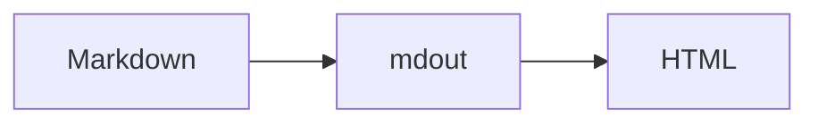

这篇文章只用于视觉回归，不会进入生产站点。行内公式使用 $E = mc^2$，独立公式如下：

$$
\int_{-\infty}^{\infty} e^{-x^2}\\,dx = \sqrt{\pi}
$$

## 正文层级

正文需要在中文、English words 和 `inline code` 混排时保持稳定节奏。

> 引用应该清晰，但不应比正文更抢眼。

### 代码与表格

```rust,name=main.rs
fn main() {
    println!("Markdown in, HTML out. Built on Zola.");
}
```

- [x] 已完成的检查项
- [ ] 尚未完成的检查项

> [!NOTE]
> 提示块由 Zola 的 GFM 支持生成，再由 mdout 负责阅读样式。

脚注也需要保持安静。[^note]

[^note]: 这是用于视觉回归的脚注内容。

| 能力 | 状态 |
| --- | --- |
| Markdown | 可用 |
| KaTeX | 可用 |
| Mermaid | 可用 |

## Mermaid


